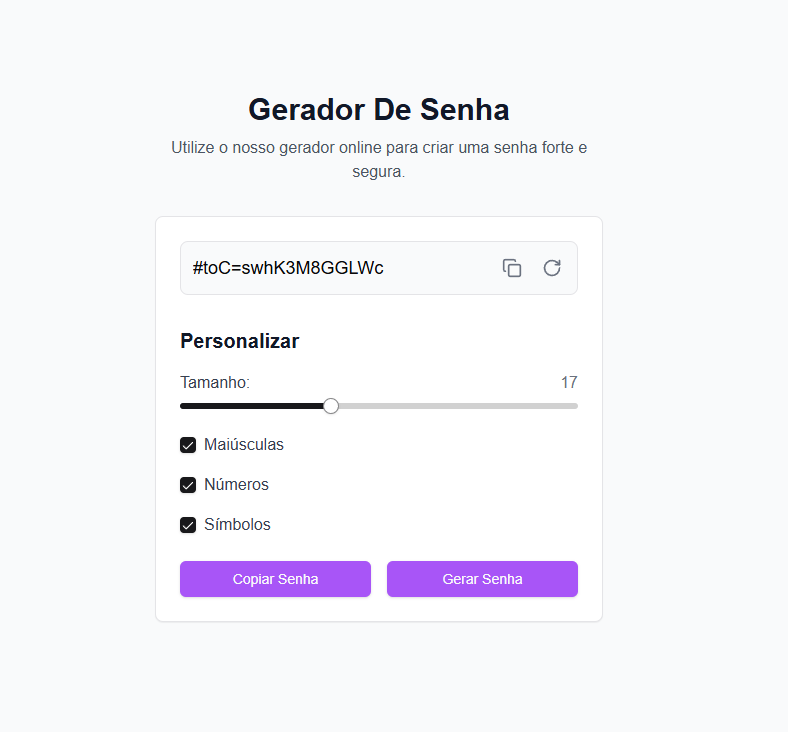

# Gerador de Senha

## Descrição

Este projeto é um gerador de senhas online desenvolvido com Next.js e React. Ele permite aos usuários criar senhas fortes e seguras com opções personalizáveis, como comprimento da senha e inclusão de maiúsculas, números e símbolos.

## Funcionalidades

- Geração de senhas aleatórias
- Personalização do comprimento da senha (8-32 caracteres)
- Opções para incluir maiúsculas, números e símbolos
- Copiar senha para a área de transferência com um clique
- Interface responsiva e amigável

- [Demo Do Projeto](https://generate-pass-two.vercel.app/)



## Tecnologias Utilizadas

- [Next.js](https://nextjs.org/)
- [React](https://reactjs.org/)
- [TypeScript](https://www.typescriptlang.org/)
- [Tailwind CSS](https://tailwindcss.com/)
- [shadcn/ui](https://ui.shadcn.com/)

## Pré-requisitos

Antes de começar, certifique-se de ter instalado em sua máquina:

- Node.js (versão 14 ou superior)
- npm (geralmente vem com o Node.js)

## Instalação

1. Clone o repositório:

    ```bash
    git clone https://github.com/TGuapyassu/GeneratePass.git
    ```
2. Navegue até o diretório do projeto:

    ```bash
    cd GeneratePass
    ```
3. Instale as dependências:

    ```bash
    npm install
    ```
4. Inicie o servidor de desenvolvimento:

    ```bash
    npm run dev
    ```

Agora você pode acessar o projeto em `http://localhost:3000`.
